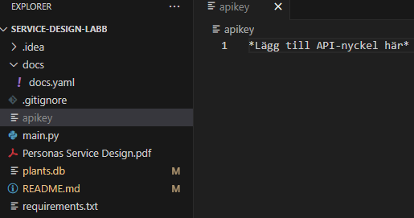

# API för företag som säljer fröer

Projekt skapat av Fatima Sobzcak & Emelie Hansson.

---

Det här backend programmet är skapat för ett företag som säljer fröer. Det innehåller tre endpoints, två 'GET' och en 'DELETE'. Detaljinformation för varje frö hämtas ifrån [Perenual](https://perenual.com/) genom API.

För att komma igång med projektet efter att man klonat från GitHub:
 
1. Skapa en fil som heter apikey. Se bild. 
 
 

 
 
2. Klistra in API-nyckeln som du får av oss i den filen.
3. Öppna kommandotolken och kör kommandot "python main.py" för att starta programmet.
4. Navigera sedan till [http://127.0.0.1:5000](http://127.0.0.1:5000).
5. Nu ska du ha landat på startsidan.
6. För att få fram listan över alla fröer i databasen, navigera till [http://127.0.0.1:5000/seeds](http://127.0.0.1:5000/seeds).
7. För att få fram information om ett specifikt frö, navigera till [http://127.0.0.1:5000/seeds/1](http://127.0.0.1:5000/seeds/1). I detta fall används ID 1, i listan går det att se hur många ID:n som finns.
8. För att komma till API dokumentationen, navigera till [http://127.0.0.1:5000/api/docs](http://127.0.0.1:5000/api/docs).

Funktionen DELETE fungerar genom att använda Postman API Platform. 

### Källor

Kursmaterial.

https://github.com/BerlinNatrolit/service-design-23

https://dev.mysql.com/doc/connector-python/en/connector-python-api-mysqlcursor-fetchone.html 

https://pynative.com/python-cursor-fetchall-fetchmany-fetchone-to-read-rows-from-table/ 

https://github.com/dylburger/reading-api-key-from-file/blob/master/Keeping%20API%20Keys%20Secret.ipynb 

https://docs.python.org/3/tutorial/datastructures.html 

https://spec.openapis.org/oas/latest.html#document-structure 

https://github.com/OAI/OpenAPI-Specification/